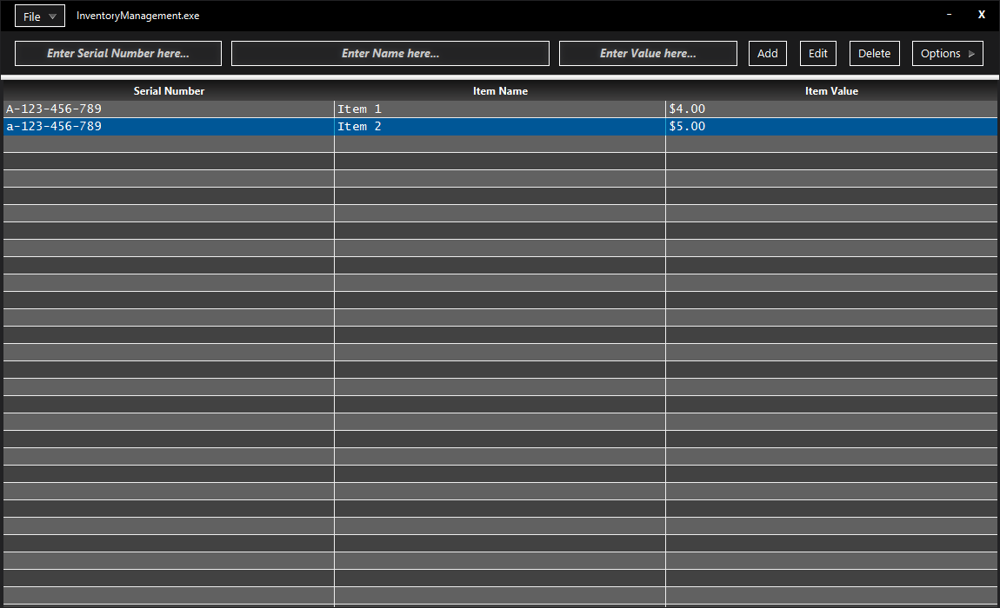
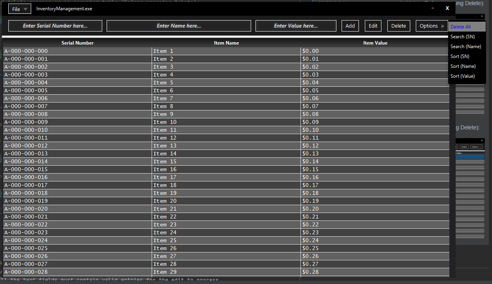
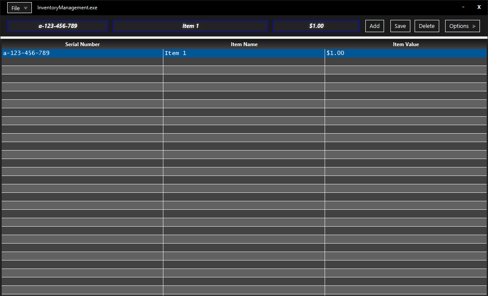
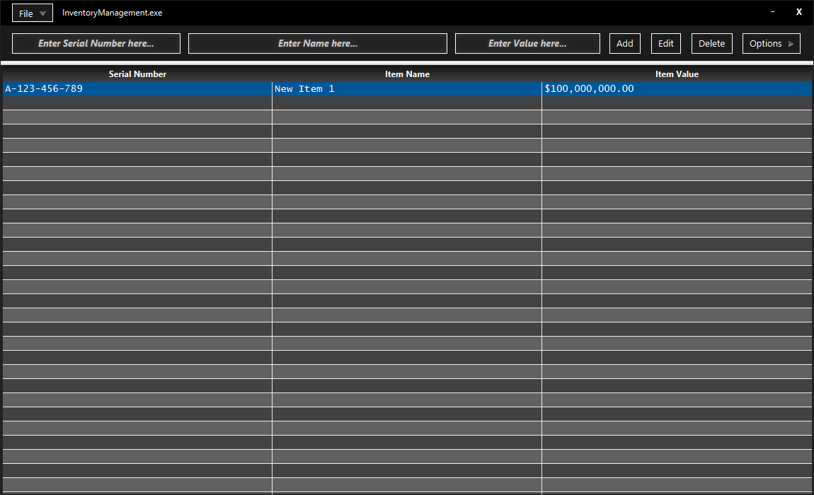
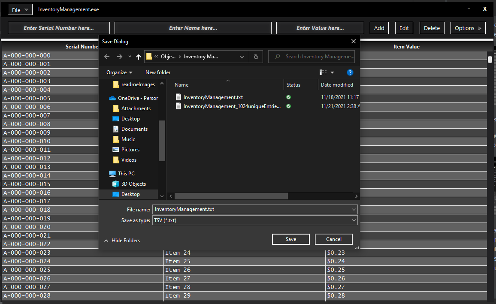
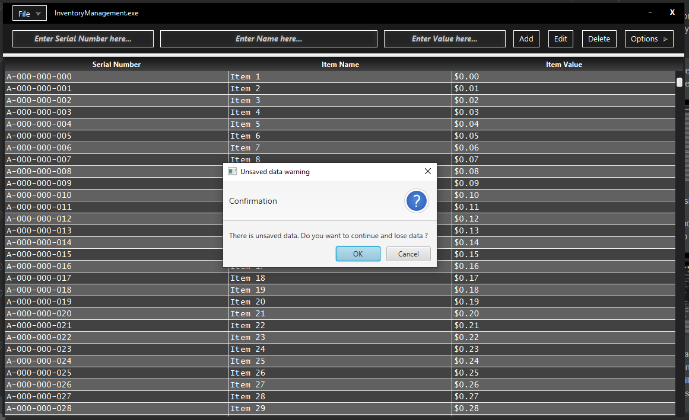
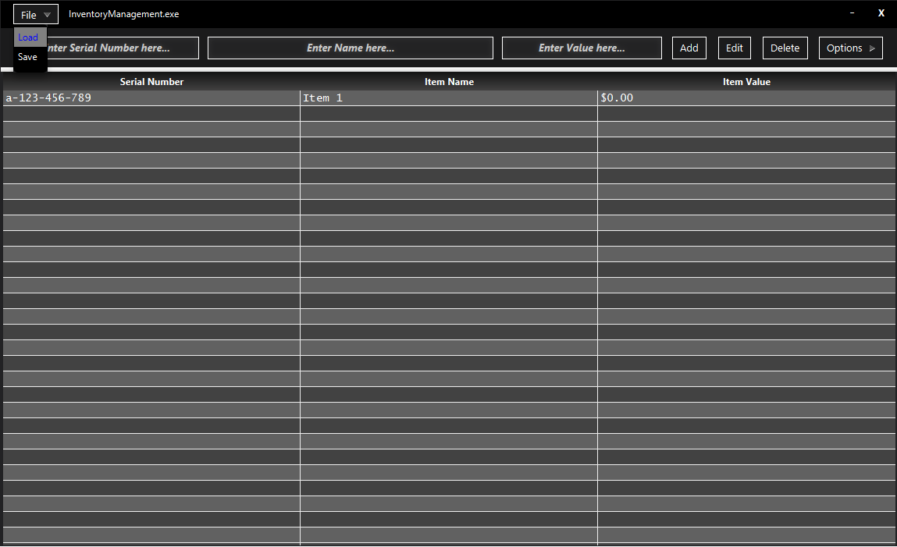

# Inventory Management

> Managing Inventory has never looked better.

---

### Table of Contents

- [Description](#description)
- [How To Use](#how-to-use)
- [Add](#add)
- [Delete](#delete)
- [Delete All](#delete-all)
- [Edit](#edit)
- [Search Serial Number](#search-sn)
- [Search Name](#search-name)
- [Sort Serial Number](#sort-sn)
- [Sort Name](#sort-name)
- [Sort Value](#sort-value)
- [Save](#save)
- [Load](#load)
- [Author Info](#author-info)

---

## Description

Managing an Inventory can be tedious and sometimes difficult. This program offers a modern solution to this task at hand.

[Back To The Top](#table-of-contents)

---

## How To Use

Below are details on the features of the program with included screenshots.

---

## Add

In order to use the Add button 3 pre-Conditions must be met.
>1) All 3 text fields must be entered.
>2) The 3 text fields entries must be in valid format.
>3) The new entry to be added must not contain a similar Serial Number to one already existing in the table.

> Valid add process on an empty table:
> 
> 
>
> After the entry was added:
> 
> 

[Back To The Top](#table-of-contents)

---

## Delete

In order to use the Delete button 1 pre-Condition must be met.
>1) An entry must be selected before clicking Delete. Therefore, Delete may not be used on an empty table.

> Valid delete process on an occupied table (Before pressing Delete):
> 
> 
> 
> Valid delete process on an occupied table (After pressing Delete):
> 
> 

[Back To The Top](#table-of-contents)

---

## Delete All

DeleteAll may be used without any preconditions, however, it only makes sense to use when the table isn't empty.

> DeleteAll process on an occupied table (Before pressing DeleteAll):
>
> 
>
> After pressing DeleteAll:
>
> 

[Back To The Top](#table-of-contents)

---

## Edit

In order to use the Edit button 2 pre-Conditions must be met.
> 1) An entry must be selected before clicking Edit. Therefore, Edit may not be used on an empty table.
> 2) All the text fields must contain valid entries for the edit to process.

> Edit process on an occupied table (Before pressing Edit):
>
> 
>
> After pressing Edit:
> 
> Edit button name changes from 'Edit' to 'Save'.
> The entry to be edited will then be displayed in their respective Description Text Fields.
>
> 
>
> The user must then click Save to apply their new edit.
> 
> 
> 
> After edit process goes through correctly:
> 
> 

[Back To The Top](#table-of-contents)

---

## Search (SN)

In order to use Search (SN) button 2 pre-Conditions must be met.
> 1) The Serial Number field must be entered and in valid format.
> 2) An entry matching the typed Serial Number exactly must exist in the table.

> Search process on an occupied table (Before pressing Search(SN)):
>
> -Pressed.png)
>
> After pressing Search(SN):
>
> The searched item will now be the only thing displayed.
>
> -Pressed.png)

[Back To The Top](#table-of-contents)

---

## Search (Name)

In order to use Search (Name) button 2 pre-Conditions must be met.
> 1) The Name field must be entered and in valid format.
> 2) An entry matching the typed Name exactly must exist in the table.

> Search process on an occupied table (Before pressing Search(Name)):
>
> -Pressed.png)
>
> After pressing Search(Name):
>
> The searched item will now be the only thing displayed.
>
> -Pressed.png)

[Back To The Top](#table-of-contents)

---

## Sort (SN)

Sorts table by Serial Number from least to greatest.

In order to use Sort(SN) 1 pre-Condition must be met.
> 1) There must be at least two entries in the table.

> Sort process on an occupied table (Before pressing Sort(SN)):
>
> -Pressed.png)
>
> After pressing Sort(SN):
>
> The table will now be sorted by Serial Number from least to greatest.
>
> -Pressed.png)

[Back To The Top](#table-of-contents)

---

## Sort (Name)

Sorts table by Name from least to greatest.

In order to use Sort(Name) 1 pre-Condition must be met.
> 1) There must be at least two entries in the table.

> Sort process on an occupied table (Before pressing Sort(Name)):
>
> -Pressed.png)
>
> After pressing Sort(Name):
>
> The table will now be sorted by Name from least to greatest.
>
> -Pressed.png)

[Back To The Top](#table-of-contents)

---

## Sort (Value)

Sorts table by Value from least to greatest.

In order to use Sort(Value) 1 pre-Condition must be met.
> 1) There must be at least two entries in the table.

> Sort process on an occupied table (Before pressing Sort(Value)):
>
> -Pressed.png)
>
> After pressing Sort(Value):
>
> The table will now be sorted by Value from least to greatest.
>
> -Pressed.png)

[Back To The Top](#table-of-contents)

---

## Save

Saves the Contents of the table to 3 different file types: .json / .html / .txt (TSV)

> Save process on an occupied table (Before pressing Save):
>
> 
>
> After pressing Save:
>
> The file chooser window appears for the user to enter save information.
>
> 
> 
>  If additional changes were made upon closing the program, an alert window will display notifying the user of unsaved changes and will verify if you wish to truly wish to quit.
>
> 

[Back To The Top](#table-of-contents)

---

## Load

Loads the contents of the file to the table. Handles 3 different file types: .json / .html / .txt (TSV)

> Load process on an occupied table (Before pressing Load):
>
> 
>
> After pressing Load:
>
> The file chooser window appears for the user to choose a file to load.
>
> 

[Back To The Top](#table-of-contents)

---

## Author Info

- Tyler King - UCF Comp Science Student
- Email - tylerking885@gmail.com

[Back To The Top](#table-of-contents)
